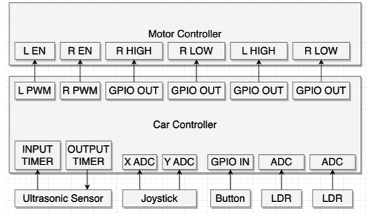
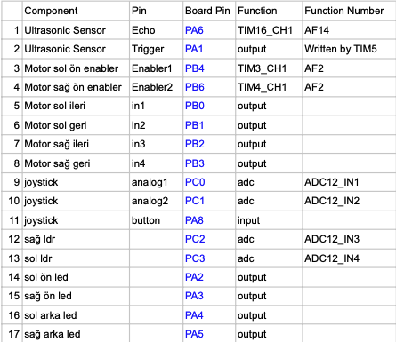
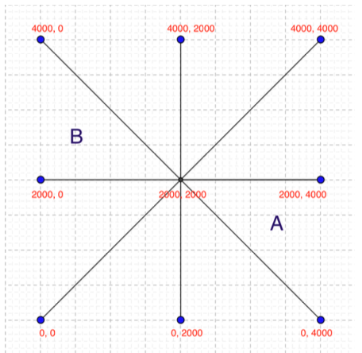

 
 
Controller software targeting STM-32 based car hardware with manual and autonomous control support

 
 

[Video demo](https://www.youtube.com/shorts/DocepiJrJJk) for completing a path automatically

[Video demo](https://www.youtube.com/shorts/8Qha08qWrV8) for manual control via joystick

 

## Peripherals

- Motor Controller with 2 PWM and 4 GPIO pins
- Joystick with 2 ADC pins, for manual control.
- Ultrasonic sensor with 1 input timer and 1 output timer
- 2 Light sensors controlled via ADC, for automatic control.

 

Peripherals block diagram

 

  

PIN table

 

  

 

## Control Mapping

The main functions to drive the motors are

> void motor_l(uint8_t forward, uint8_t backward, uint16_t speed)
> void motor_r(uint8_t forward, uint8_t backward, uint16_t speed)

Important argument is “speed” here. It’s a value between 0 and 2000, and this parameter is directly fed into PWM timer. As the ARR value for the timer is 2000, this value directly determines the speed of the motor.

There’s one more abstraction layer that calls these functions depending on the joystick input:

> void dir_speed_control(uint16_t x, uint16_t y)

After analog inputs of Joystick are read, they go through some normalization / tuning
and then fed into this function.
This function imagines an analytical plane that is divided into 8 sections as seen in the following figure.

 

Control mapping plane

 

  

 

Each triangular section can be seen clearly inside corresponding if blocks in the function. x-axis is vertical and y-axis is horizontal.

Here is an idea on how it behaves:

- 4000, 2000 makes the car go forwards with full speed
- 0, 2000 makes the car go backwards with full speed
- 3000, 2000 makes the car go forwards with half speed
- As we move from 4000, 2000 to 4000, 4000 ; the car turns right by slowing
  down and finally stopping the right tires. The right tires stop entirely at
  4000, 4000. Similar for from 4000,2000 to 4000, 0.
- As we move from 4000, 4000 to 2000, 4000 ; In addition to left tires going
  forward with full speed, the right tires start to go backwards. Exactly at 2000, 4000 ; the car performs point turn to right side because left tires go forward and right tires go backward at given speed. This behavior is the same for the other side as well.
- The phases get reverted when we go below the horizontal axis (y axis). To make it more clear: As you move the joystick further down when making a right point turn, the tires immediately revert their direction. In this sense, for sections A and B, the directions and the L-R order are completely reverse of each other.
- When values are smaller than the extremes shown in the figure, it just slows down the speed.
